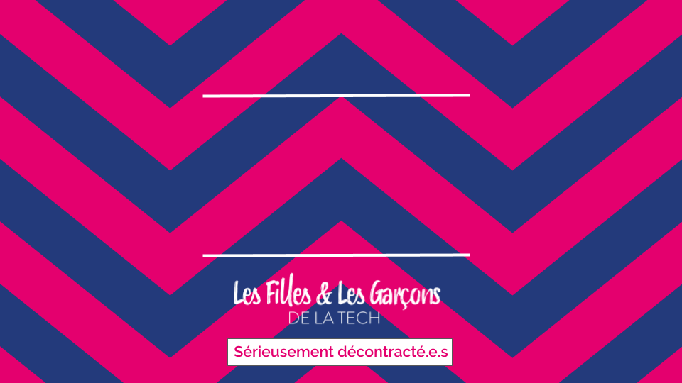
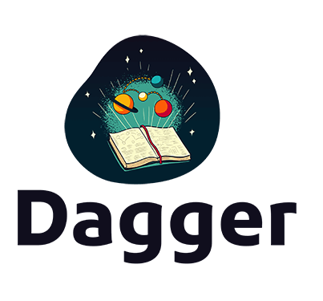

---
<!-- _class: part -->

ORIGINE

---
# UN BESOIN

Solomon Hykes, Andrea Luzzardi et Sam Alba, les créateurs de **Docker**, font un constat :

- **Chaque société développe son propre framework interne pour intégrer les différents outils liés au DevOps ensemble.**

- **Avoir à commit et push pour tester un change sur un pipeline, c'est lent...** :sleeping:

___
# UNE REPONSE

"Un ***DevKit portable de CI/CD***
La ***superglue*** DevOps"

## **Intérêt ?**
- S'abstraire de tous les outils habituels du DevOps
- Unifier le dev et la CI
- Gestion du cache et des artefacts intermédiaires
- Enfin du debug de pipeline en local... :heart_eyes:

---

<!-- _class: part -->

PRINCIPE

---

# LE DAG

___

# UN PLAN

Le plan décrit les différentes étapes, les entrées...
___

<!-- _class: sommaire -->
# Sommaire
- Origine
- Principe
- Cue
- Quelques effets démo

___

# Introduction

### **Génèse**
- Dévoilé en juin 2014 et présenté en version stable 1.0 un an plus tard.
- Kubernetes est la reécriture en Go du système Borg que Google utilise en interne depuis 15 ans (2 milliards de conteneurs par semaine)
- Il a été open-sourcé et sa gouvernance a été transmise à la [CNCF](https://www.cncf.io/about/members/) (1er projet [mais pas le dernier]((https://www.cncf.io/projects/)))
