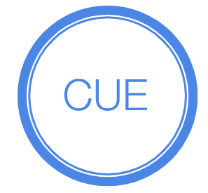
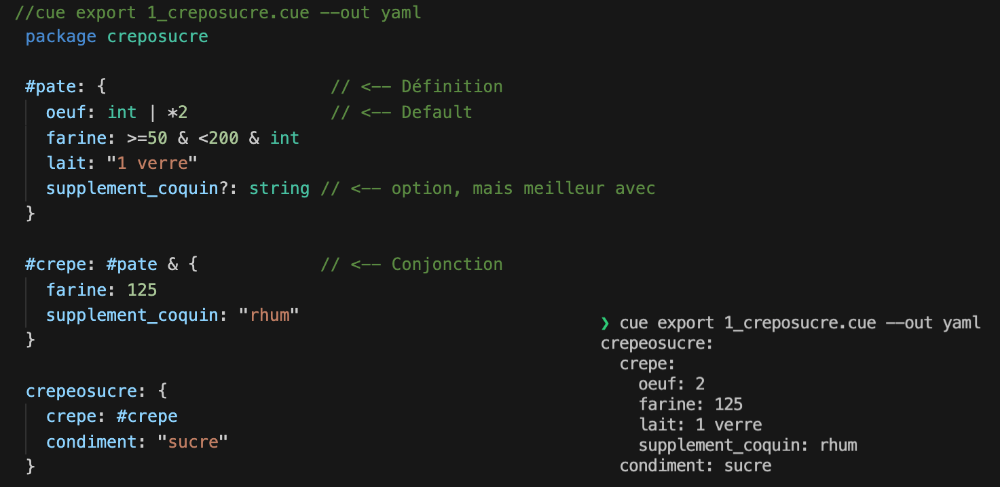
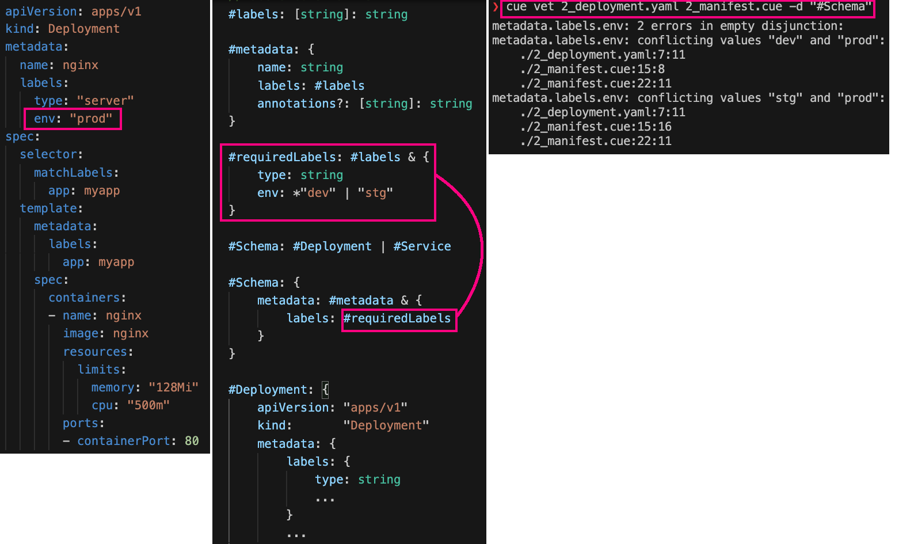
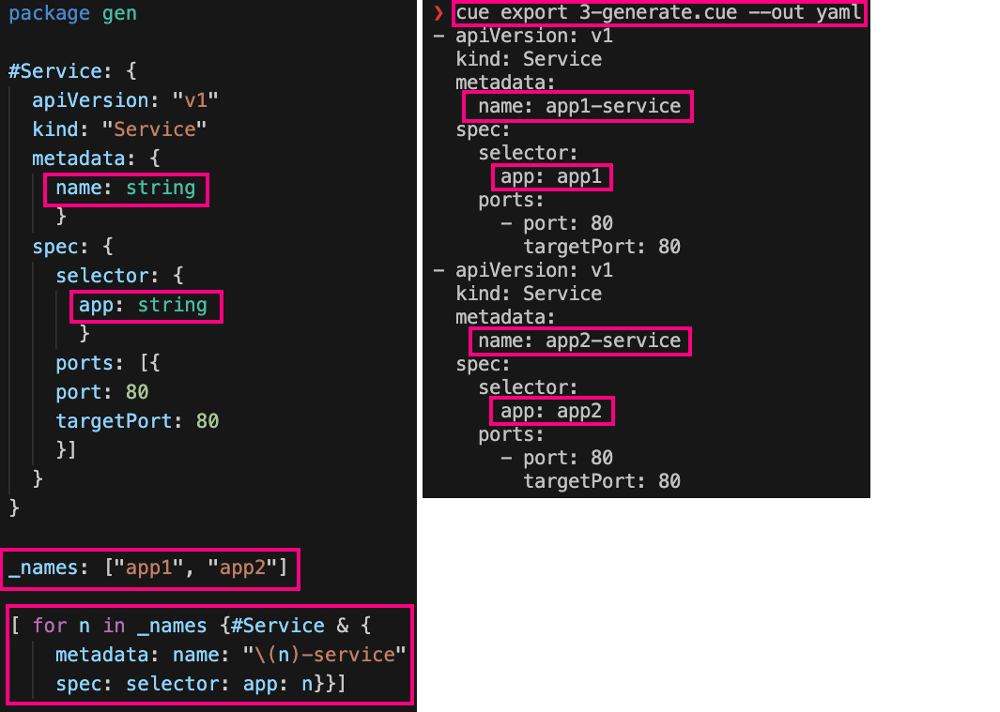
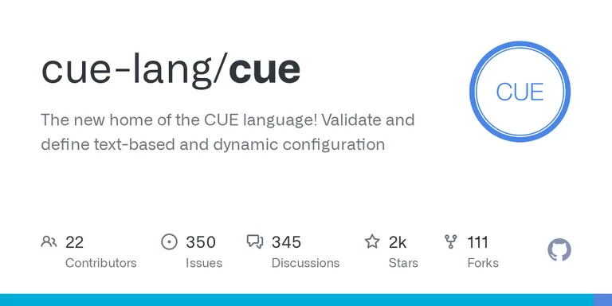
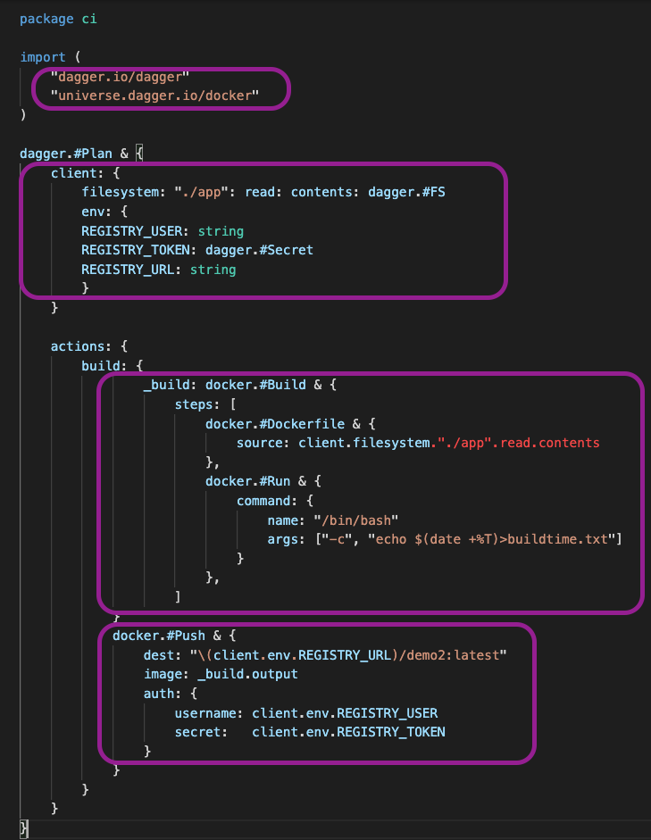
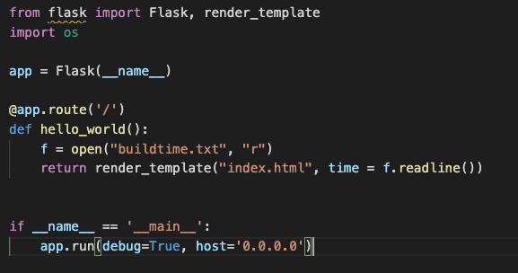
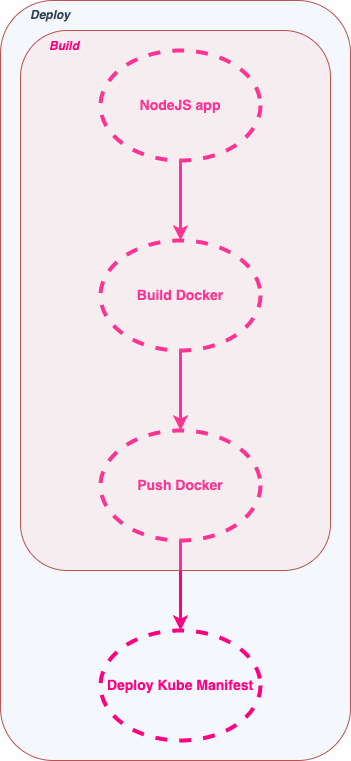
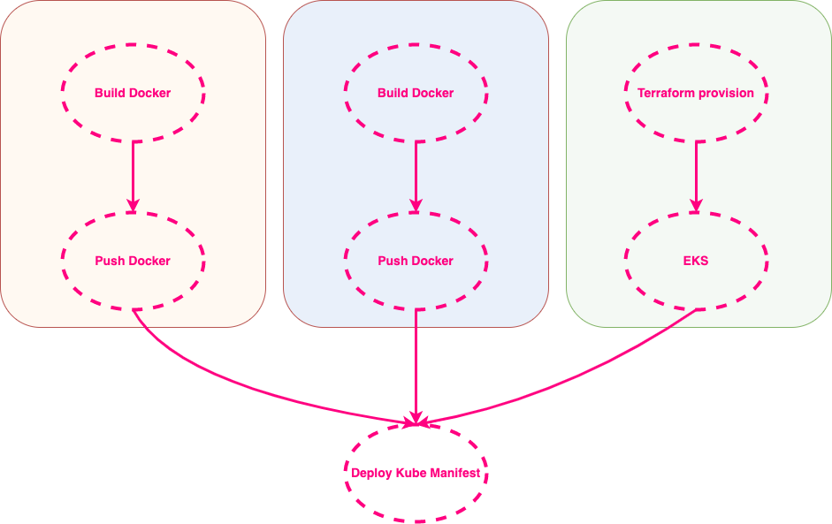

---
<!-- _class: part -->

ORIGINE

---
# UN BESOIN

Solomon Hykes, Andrea Luzzardi et Sam Alba, les créateurs de **Docker**, font un constat :

- **Chaque société développe son propre framework interne pour intégrer les différents outils liés au DevOps ensemble.**

- **Avoir à commit et push pour tester un change sur un pipeline, c'est lent...** :sleeping:

___
# UNE REPONSE

"Un ***DevKit portable de CI/CD***
La ***superglue*** DevOps"

## **Intérêt ?**
- S'abstraire de tous les outils habituels du DevOps
- ***CI platform agnostic***
- Du vrai développement de CI
- Gestion du cache et des artefacts intermédiaires
- Enfin du debug de pipeline en local... :heart_eyes:

---

# DAGGER

## **Comment ?**
- *Any Docker Compatible Runtime*
- Cuelang

## **Pour qui ?**
- Tu as honte de tes 50 runs rouges sur Jenkins parce que tu ne sais pas écrire 3 lignes de Groovy ?
 - Tu n'en peux plus d'attendre après la CI qui ne fait que planter pour tester ton change ?
---

<!-- _class: part -->

PRINCIPE  

---

# LE DAG

___

# LE DAG

___

# LE DAG

---

# DES INGREDIENTS

Des packages *Cue* qui permettent de **s'abstraire** des outils.

---

# UN PLAN

___

<!-- _class: part -->

CUELANG

---

# Configure, Unify, Execute

- Créé par Marcel van Lohuizen chez Google en 2018
- JSON sous stéroides
- Définir, valider et utiliser de la data
- Notions:
  - Packages
  - Les types sont des valeurs
  - Contraintes, définitions, schémas...
  - Valeurs par défaut

---

# CUE RECETTE

___

# CUE VALIDATION

___

# CUE GENERATION

---

# POUR DEMARRER

- ## [Cuetorials.com](https://cuetorials.com/introduction/)
- ## [Cuelang.org](https://cuelang.org/)
- ## [Playground](https://cuelang.org/play/#cue@export@cue)
___

<!-- _class: part -->

EXEMPLES
___

# BUILD & PUSH

- Builder et pusher un simple conteneur sur un registry
- Exécuter ce pipeline aussi bien en local qu'en remote
- Utiliser des packages tout prêts
___

# BUILD & PUSH

 

- Plan portable: en local, ou sur [Github Actions](https://github.com/arnaud-soulie/dagger_demo/actions/workflows/ci_demo2.yml)
- [Effet démo](http://localhost:12345)
- [Docker Hub](https://hub.docker.com/r/fgtech/demo2)

___

# DEPLOIEMENT KUBE

___

# UN PEU PLUS LOIN

- Provisionner de l'infrastructure et l'utiliser à la volée
- Gestion des **monorepos**
- Librairies sur la v0.2.x réduites : voter pour les prochaines implémentations [ici](https://github.com/dagger/dagger/discussions/1922)

___

# ET ENSUITE ?

- [Dagger.io](https://dagger.io/)
- [Discord](https://discord.com/channels/707636530424053791/796905486145683506/955856707773407292)
- [Documentation](https://docs.dagger.io/)
- [Github](https://github.com/dagger/dagger)
- Release courante : v0.2.4
- [Exemples](https://github.com/dagger/dagger/tree/main/pkg/universe.dagger.io/examples)
- Discussions:
  - [Which CI environment integration should we cover next?](https://github.com/dagger/dagger/discussions/1677)
  - [What should we add next to the Dagger Universe?](https://github.com/dagger/dagger/discussions/1922)
- Sujets à venir:
  - Gérer des backends de cache
  - Génération d'un visuel de DAG
  - 
