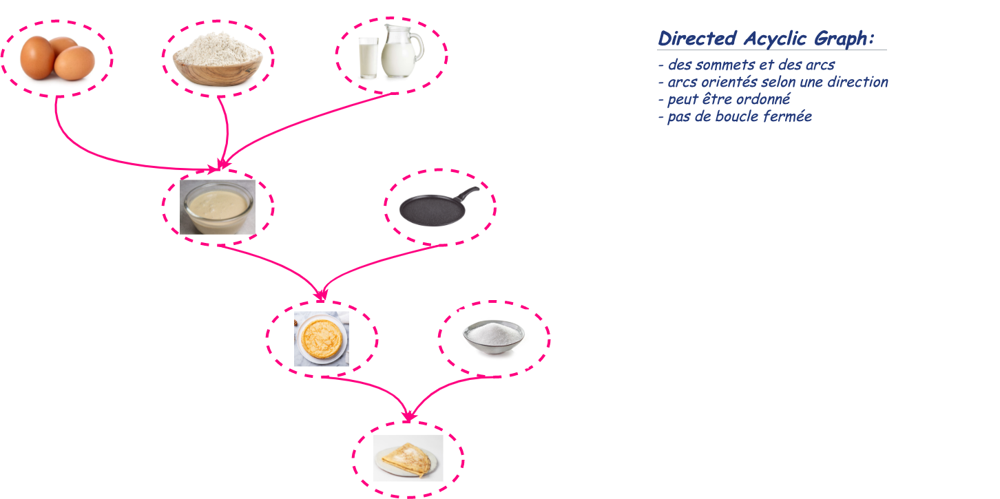
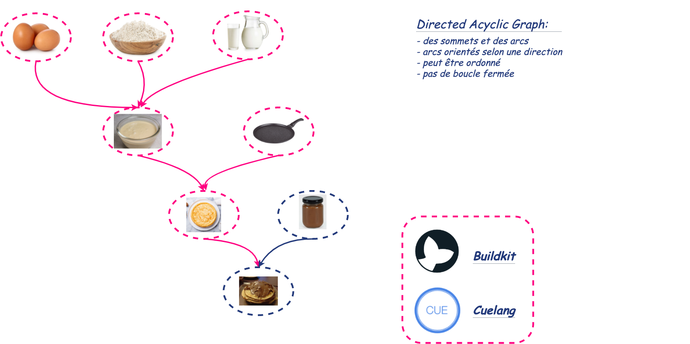
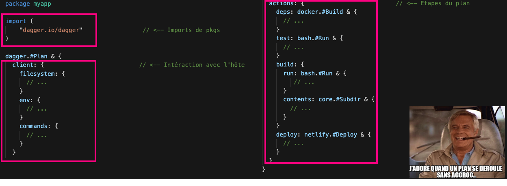

---
<!-- _class: part -->

ORIGINE

---
# UN BESOIN

Solomon Hykes, Andrea Luzzardi et Sam Alba, les créateurs de **Docker**, font un constat :

- **Chaque société développe son propre framework interne pour intégrer les différents outils liés au DevOps ensemble.**

- **Avoir à commit et push pour tester un change sur un pipeline, c'est lent...** :sleeping:

___
# UNE REPONSE

"Un ***DevKit portable de CI/CD***
La ***superglue*** DevOps"

## **Intérêt ?**
- S'abstraire de tous les outils habituels du DevOps
- Unifier le dev et la CI
- Gestion du cache et des artefacts intermédiaires
- Enfin du debug de pipeline en local... :heart_eyes:

---

<!-- _class: part -->

PRINCIPE

---

# LE DAG

___

# LE DAG

___

# LE DAG

---

# DES INGREDIENTS

Des packages *Cue* qui permettent de **s'abstraire** des outils spécifiques.

---

# UN PLAN

___

<!-- _class: part -->

CUELANG

---

# CUELANG

- JSON sous stéroides
- Packages
- Les types sont des valeurs
- Contraintes, définitions, schémas...
- Valeurs par défaut

---

# CUE RECETTE

___

# CUE VALIDATION

___

# CUE GENERATION

___
